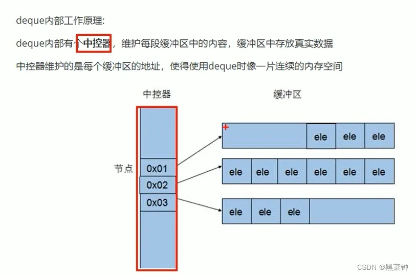

任何数据结构都是为了实现某种特定算法，STL容器就是将运用最广泛的一些数据结构实现出来，

例如——数组、链表、树、栈、队列、集合、映射表

# STL

## vector 向量（动态数组）

- **动态大小**：`vector` 的大小可以根据需要自动增长和缩小。
- **连续存储**：`vector` 中的元素在内存中是<mark>连续存储</mark>的，这使得访问元素非常快速。
- **可迭代**：`vector` 可以被迭代，你可以使用循环（如 `for` 循环）来访问它的元素。
- **元素类型**：`vector` 可以存储任何类型的元素，包括内置类型、对象、指针等。

> 与数组的区别：vector可动态分配
>
> 动态分配——vector先开辟一块空间，然后假如需要的空间大于这个开辟的空间了，vector不会在原有空间后面再开辟一块空间，而是在其他地方再找一块空间，然后把原有空间的值给复制到这个新空间，然后插入需要的值，这种方法导致——原有的迭代器将没用了，它们指向的不是这个新的空间，而老的空间已经报废了，因此这个动态内存分配会出现这个问题

## string 

- string是一个类，***类内部封装了char\****, 管理这个字符串，是一个char\*型的容器

- string类内部封装了很多**成员方法**

- string**管理char\*所分配的内存**

string(); //创建一个空的字符串例如：string  str;
string(const char*s); //使用字符串s初始化
string(const string& str); //使用一个string对象初始化另一个string对象
string(int n, char c); //使用n个字符c初始化

查找

>int find(const string& str, int pos) const; //查找str第一次出现位置，从pos开始查找
>int find(const char* s, int pos )const; //查找s第一次出现位置，从pos开始查找
>int find(const char* s, int pos, int n) const; //从pos位置查找s的前个字符第一次位置
>int find(const char c, int pos) const; //查找字符c第一次出现位置
>int rfind(const string& str, int pos) const; //查找str最后一次位置，从pos开始查找
>int rfind(const char* s, int pos) const; //查找s最后一次出现位置，从pos开始查找
>int rfind(const char* s, int pos, int n) const; //从pos查找s的前n个字符最后一次位置
>int rfind(const char c, int pos) const; //查找字符c最后一次出现位置
>string& replace(int pos, int n, const string& str); //替换从pos开始n个字符为字符串str
>string& replace(int pos, int n, const char* s); //替换从pos开始的n个字符为字符串s

> **注意：⭐rfind从右往左查找 find从左往右查找**

插入删除

> string& insert(int pos,const char*s); //插入字符串
> string& insert(int pos,const string& str); //插入字符串
> string&insert(int pos,int n,char c); //在指定位置插入n个字符c
> string&erase(int pos,int npos); //删除从pos开始的n个字符

## deque容器

区别——vector为单端数组，头插不好插，而这个头插比较方便，vector的访问遍历比较快，因为它是连续的空间

## stack容器

stack是一种先进后出的数据结构，只有一个出口，也就是我们俗说的栈

栈不允许有遍历行为，只有顶部元素可以使用

## queue容器

queue是一种先进先出的数据结构，有两个出口。

队列容器允许从**一端新增元素**，从**另一端移除元素**
队列中只有**队头和队尾才可以被外界使用**，因此队列**不允许有遍历行为**
队列中进数据称为--入队 **push**

## list容器

将数据链式存储起来

## set容器/multiset容器

**简介**

> 所有元素都会在插入时自动被排序
> 本质：
> setmultset属于关联式容器，底层结构是用二叉树实现。

**区别**

> set和multiset区别：
> set不许容器中有重复的元素
> multiset允许容器中有重复的元素
>
> **因为**：
>
> set插入数据的同时会返回插入结果，表示插入是否成功
> multiset不会检测数据，因此可以插入重复数据

multiset

> 头文件 \#include\<algorithm\>
>
> std::multiset<int> b;

## map容器/multimap容器

简介

> map中所有元素都是pair对组
> pair中第一个元素为key(键值）,起到**索引作用**，第二个元素为**value(实值）**
> 所有元素都会根据元素的键值自动排序

优点

> 可以根据key值快速找到value值

区别

> map不允许容器中有重复key值元素
> multimap允许容器中有重复key值元素

