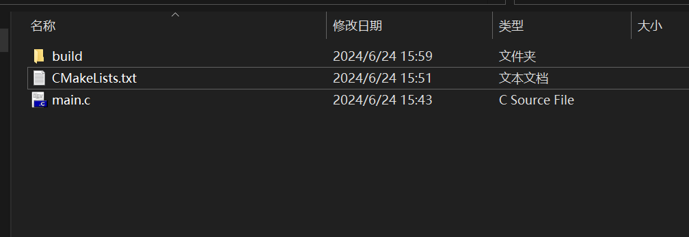
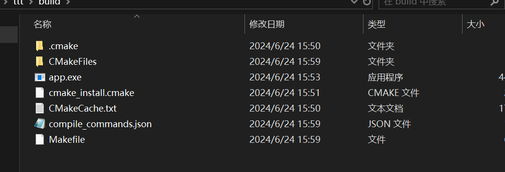

1. 一般在build文件下，执行 *cmke ..* 命令，把过程性文件生成在build文件夹下。
2. cmake后会生成makefile文件，需要再执行make指令
3. 注意 *CmakeLists.txt* 名称的书写，必须完全一致
4. 若在主目录已经生成了相关文件，在build就无法生成相关的文件了，相关文件如上图，可以删除后尝试重新生成
5. ==!!!!== windows下，有时候vscode 执行 *cmake..* 过不去，尝试退出重进vscode，或者清空build文件夹下的文件，执行一次 *cmake -G "MinGW Makefiles" ..* 命令

***[cmake学习](https://subingwen.cn/cmake/CMake-primer/?highlight=cmake)***

## 内置变量

- CMAKE_CURRENT_SOURCE_DIR

  > 执行cmake命令时，后面提供的路径

- PROJECT_SOURCE_DIR

  > 使用的 CMakeLists.txt 所在的根目录（一个项目里可能有不同的组件，不同的CmakeLists.txt，所以目录的路径也不同）

- LIBRARY_OUTPUT_PATH

  > 通过set 设置库的生成路径，没有则会创建

- cmake_minimum_required(VERSION 3.10)

> 指定cmake的版本（可以没有）

- project(test)

> 指定cmake的项目名称，有很多参数，一般指定个名字就行

- add_executable(app main.c)

> 添加编译文件
>
> app 是最终生成的可执行文件，main.c是参与编译的文件
>
> 多个文件，以空格或 ; 为间隔隔开即可

## 变量的设置与使用

- SET命令

> - SET(val main.c)
>
> 该指令把“main.c”以字符串的方式存入val中，不特殊指定，都以字符串存入
>
> - 也可以设置指定的宏 
>
> set(EXECUTABLE_OUTPUT_PATH path)  <path为路径>
>
> 设置生成的可执行文件的路径

- 变量使用

> ${val}

## 路径文件搜索

- aux_source_directory(${PROJECT_SOURCE_DIR} src)

> 第一个宏，是执行cmake后给的路径，第二个是要存储的变量
>
> - 不能递归搜索，只能按照给定的路径搜索

- file(GLOB src ${CMAKE_CURRENT_SOURCE_DIR}/*.c)

  - GLOB

    > 将指定目录下搜索到的满足条件的所有文件名生成一个列表，并将其存储到变量中。

  - GLOB_RECURSE

    > 递归搜索指定目录，将搜索到的满足条件的文件名生成一个列表，并将其存储到变量中。
    >
    > !! cmake会产生临时文件在build，会导致临时文件也被扫描到，就需要把build放到项目外部

> 第一个参数：代表一种文件的操作
>
> 第二个参数：变量
>
> 第三个参数：路径以及文件的类型，这里用 \*.c表示要识别的文件类型
>
> > CMAKE_CURRENT_SOURCE_DIR 这个宏表示CmakeLists.txt所在的文件路径
> >
> > 这个方式会*递归*搜索文件

## 包含头文件

- include_directories(${CMAKE_CURRENT_SOURCE_DIR}/inc)

## 打印输出消息

- message([状态]  “消息”)

  > 消息的引号，写不写都可以

# 库

## 制作库

- add_library(库名 库属性 文件)

  > - 最终生成的库文件名，lib+库名+后缀

### 静态库 

> linux环境下，以.a结尾
>
> windows环境下，以.lib结尾

- add_library(arg STATIC ${SRC})

### 动态库

> linux环境下，以.so结尾
>
> windows环境下，以.dll结尾

- add_library(arg SHARED ${SRC})

## 使用库

- link_directories(${CMAKE_CURRENT_SOURCE_DIR}/lib1)

  > 指定库的路径（静、动态都可以）

### 静态库

- link_libraries(库名)

  > 库名，可以是精简名（如：libarg.a，库名写arg即可），也可以写全名

### 动态库

- target_link_libraries(可执行文件  动态库)

  > - 链接要放在可执行文件下面
  > - 动态库 库名只写精简名即可